# Wonton POS Midterm 16-UC ERD

This file is the midterm-scoped logical data model for the selected `UC-01..UC-16` set.

Instead of forcing every entity into one dense ERD, this document is organized into:

1. a high-level overview ERD for fast understanding
2. a customer ordering and payment view
3. an operations view for table / pickup / kitchen flows
4. a feedback and notification view

That keeps the model readable while still covering the same midterm scope.

## Explicitly Excluded From This Midterm ERD

- promotions and discount-redemption tables
- delivery and third-party delivery-platform integration
- deep authentication submodels such as OTP reset records and multi-provider login identities
- detailed inventory / 86'd audit tables / batch-cooking control tables
- receipt-print logs, export-file tracking, loyalty, payroll, and other future modules

## Midterm Modeling Decisions

- `CUSTOMER_ACCOUNT` and `STAFF_ACCOUNT` keep authentication fields inline to stay lightweight for the midterm.
- `CUSTOMER_ORDER` supports three ownership patterns:
  - registered self-service order via `customer_id`
  - guest self-service order via `guest_session_key` + `ORDER_CONTACT`
  - walk-in counter order via `created_by_staff_id`
- `ORDER_CONTACT` is optional overall, but guest self-service orders must store `{recipient_name, recipient_phone}` so guest tracking by `{order_code + phone}` works.
- `Takeaway` and `Pickup` are payment-gated. They must not move into kitchen progress states until `payment_status = Paid`.
- `Pickup` requires one `PICKUP_SCHEDULE` row; `Dine-in` uses `TABLE_ASSIGNMENT`; `Takeaway` uses neither.
- `ORDER_ITEM` keeps `item_status` and `prepared_quantity` so the midterm model can represent item-level kitchen progress and partial-ready batches without introducing a heavier per-bowl entity.
- `ORDER_STATUS_HISTORY` is the audit source for tracking and real-time notification fan-out.
- `NOTIFICATION` is intentionally simplified for the midterm. Each delivery target becomes one row instead of using the full-system split between event and recipient tables, but it can still point to either order events or menu-item events through `event_scope`.
- `WEB_PUSH_SUBSCRIPTION` is kept because `UC-16` includes browser push support for both registered and guest flows.
- Revenue statistics in `UC-07` are derived from `CUSTOMER_ORDER`, `ORDER_ITEM`, `MENU_ITEM`, and `PAYMENT_TRANSACTION`; no separate summary tables are added in this midterm ERD.

## 1. ERD Overview

Use this diagram first. It shows the midterm data domains and how they connect, without distracting field-level detail.

```mermaid
erDiagram
    %% Accounts and access
    CUSTOMER_ACCOUNT |o--o{ CUSTOMER_ORDER : places
    CUSTOMER_ACCOUNT |o--o{ CART : owns
    CUSTOMER_ACCOUNT ||--o{ ORDER_REVIEW : writes
    CUSTOMER_ACCOUNT |o--o{ WEB_PUSH_SUBSCRIPTION : subscribes
    CUSTOMER_ACCOUNT |o--o{ NOTIFICATION : receives

    STAFF_ACCOUNT ||--o{ STAFF_ROLE : has
    ROLE ||--o{ STAFF_ROLE : grants
    STAFF_ACCOUNT |o--o{ CUSTOMER_ORDER : creates_counter
    STAFF_ACCOUNT |o--o{ PAYMENT_TRANSACTION : processes
    STAFF_ACCOUNT |o--o{ ORDER_STATUS_HISTORY : updates
    STAFF_ACCOUNT |o--o{ TABLE_ASSIGNMENT : assigns
    STAFF_ACCOUNT |o--o{ NOTIFICATION : receives

    %% Menu and cart
    MENU_CATEGORY ||--o{ MENU_ITEM : groups
    MENU_ITEM ||--o{ MENU_ITEM_TOPPING : offers
    TOPPING ||--o{ MENU_ITEM_TOPPING : available_for
    CART ||--o{ CART_ITEM : contains
    CART_ITEM ||--o{ CART_ITEM_TOPPING : customizes

    %% Ordering and payment
    CUSTOMER_ORDER ||--o| ORDER_CONTACT : captures
    CUSTOMER_ORDER ||--|{ ORDER_ITEM : contains
    ORDER_ITEM ||--o{ ORDER_ITEM_TOPPING : customizes
    CUSTOMER_ORDER ||--o{ PAYMENT_TRANSACTION : has
    CUSTOMER_ORDER ||--o{ ORDER_STATUS_HISTORY : records

    %% Dine-in and pickup operations
    DINING_TABLE ||--o{ TABLE_ASSIGNMENT : hosts
    CUSTOMER_ORDER ||--o{ TABLE_ASSIGNMENT : seats
    PICKUP_SLOT ||--o{ PICKUP_SCHEDULE : allocates
    CUSTOMER_ORDER ||--o| PICKUP_SCHEDULE : schedules

    %% Feedback and notifications
    CUSTOMER_ORDER ||--o| ORDER_REVIEW : receives
    CUSTOMER_ORDER ||--o{ NOTIFICATION : triggers
    MENU_ITEM |o--o{ NOTIFICATION : triggers
```



## 2. Customer Ordering And Payment View

This view focuses on the customer-facing midterm flows:

- `UC-01` Place Online Order
- `UC-02` Online Payment
- `UC-03` Schedule Pickup Order
- `UC-04` View Order History
- `UC-09` Create In-Store Order
- `UC-10` Process Payment
- `UC-11` Track Order

```mermaid
erDiagram
    CUSTOMER_ACCOUNT |o--o{ CART : owns
    CUSTOMER_ACCOUNT |o--o{ CUSTOMER_ORDER : places
    STAFF_ACCOUNT |o--o{ CUSTOMER_ORDER : creates_counter
    STAFF_ACCOUNT |o--o{ PAYMENT_TRANSACTION : processes

    MENU_CATEGORY ||--o{ MENU_ITEM : groups
    MENU_ITEM ||--o{ MENU_ITEM_TOPPING : offers
    TOPPING ||--o{ MENU_ITEM_TOPPING : available_for

    CART ||--o{ CART_ITEM : contains
    MENU_ITEM ||--o{ CART_ITEM : added_as
    CART_ITEM ||--o{ CART_ITEM_TOPPING : customizes
    TOPPING ||--o{ CART_ITEM_TOPPING : selected_as

    CUSTOMER_ORDER ||--o| ORDER_CONTACT : captures
    CUSTOMER_ORDER ||--|{ ORDER_ITEM : contains
    MENU_ITEM ||--o{ ORDER_ITEM : ordered_as
    ORDER_ITEM ||--o{ ORDER_ITEM_TOPPING : customizes
    TOPPING ||--o{ ORDER_ITEM_TOPPING : selected_as
    CUSTOMER_ORDER ||--o{ PAYMENT_TRANSACTION : has
    CUSTOMER_ORDER ||--o{ ORDER_STATUS_HISTORY : records

    CUSTOMER_ACCOUNT {
        uuid customer_id PK
        string full_name NN
        string phone UK
        string email UK
        string password_hash NN
        string account_status NN
        datetime created_at NN
        datetime updated_at
    }

    STAFF_ACCOUNT {
        uuid staff_id PK
        string employee_code UK
        string full_name NN
        string phone UK
        string email UK
        string password_hash NN
        boolean is_active NN
        datetime created_at NN
        datetime updated_at
    }

    MENU_CATEGORY {
        uuid category_id PK
        string category_name UK
        int display_order
        boolean is_active NN
    }

    MENU_ITEM {
        uuid menu_item_id PK
        uuid category_id FK
        string item_name NN
        decimal base_price NN
        string description
        string image_url
        string availability_status NN
        boolean is_active NN
    }

    TOPPING {
        uuid topping_id PK
        string topping_name UK
        decimal extra_price NN
        boolean is_active NN
    }

    MENU_ITEM_TOPPING {
        uuid menu_item_topping_id PK
        uuid menu_item_id FK
        uuid topping_id FK
    }

    CART {
        uuid cart_id PK
        uuid customer_id FK
        string guest_session_key
        string service_type
        datetime created_at NN
        datetime updated_at NN
    }

    CART_ITEM {
        uuid cart_item_id PK
        uuid cart_id FK
        uuid menu_item_id FK
        int quantity NN
        decimal unit_price_snapshot NN
        string note
    }

    CART_ITEM_TOPPING {
        uuid cart_item_topping_id PK
        uuid cart_item_id FK
        uuid topping_id FK
        int quantity NN
        decimal extra_price_snapshot NN
    }

    CUSTOMER_ORDER {
        uuid order_id PK
        string order_code UK
        uuid customer_id FK
        string guest_session_key
        uuid created_by_staff_id FK
        string order_source NN
        string service_type NN
        int party_size
        string order_status NN
        string payment_status NN
        decimal subtotal_amount NN
        decimal total_amount NN
        datetime placed_at NN
        datetime completed_at
        datetime cancelled_at
        string cancellation_reason
    }

    ORDER_CONTACT {
        uuid order_contact_id PK
        uuid order_id FK UK
        string recipient_name NN
        string recipient_phone NN
        string recipient_email
        boolean is_guest_checkout NN
    }

    ORDER_ITEM {
        uuid order_item_id PK
        uuid order_id FK
        uuid menu_item_id FK
        int quantity NN
        decimal unit_price_snapshot NN
        string item_status NN
        int prepared_quantity NN
        string note
    }

    ORDER_ITEM_TOPPING {
        uuid order_item_topping_id PK
        uuid order_item_id FK
        uuid topping_id FK
        int quantity NN
        decimal extra_price_snapshot NN
    }

    PAYMENT_TRANSACTION {
        uuid payment_id PK
        uuid order_id FK
        uuid processed_by_staff_id FK
        string payment_method NN
        string provider_code
        decimal amount NN
        decimal cash_received_amount
        decimal change_amount
        string transaction_status NN
        string gateway_reference UK
        datetime initiated_at NN
        datetime confirmed_at
        datetime expires_at
    }

    ORDER_STATUS_HISTORY {
        uuid order_status_history_id PK
        uuid order_id FK
        uuid changed_by_staff_id FK
        string actor_type NN
        string from_order_status
        string to_order_status
        string from_payment_status
        string to_payment_status
        string change_reason
        datetime changed_at NN
    }
```

## 3. Operations View

This view focuses on staff-side operational flows:

- `UC-06` Manage Staff
- `UC-08` Manage Tables
- `UC-12` Assign Order To Table
- `UC-13` Receive Kitchen Orders
- `UC-14` Update Dish Status

```mermaid
erDiagram
    STAFF_ACCOUNT ||--o{ STAFF_ROLE : has
    ROLE ||--o{ STAFF_ROLE : grants

    STAFF_ACCOUNT |o--o{ CUSTOMER_ORDER : creates_counter
    STAFF_ACCOUNT |o--o{ ORDER_STATUS_HISTORY : updates
    STAFF_ACCOUNT |o--o{ TABLE_ASSIGNMENT : assigns
    STAFF_ACCOUNT |o--o{ TABLE_ASSIGNMENT : releases

    CUSTOMER_ORDER ||--|{ ORDER_ITEM : contains
    DINING_TABLE ||--o{ TABLE_ASSIGNMENT : hosts
    CUSTOMER_ORDER ||--o{ TABLE_ASSIGNMENT : seats

    PICKUP_SLOT ||--o{ PICKUP_SCHEDULE : allocates
    CUSTOMER_ORDER ||--o| PICKUP_SCHEDULE : schedules

    STAFF_ACCOUNT {
        uuid staff_id PK
        string employee_code UK
        string full_name NN
        string phone UK
        string email UK
        string password_hash NN
        boolean is_active NN
        datetime created_at NN
        datetime updated_at
    }

    ROLE {
        smallint role_id PK
        string role_code UK
        string role_name UK
    }

    STAFF_ROLE {
        uuid staff_role_id PK
        uuid staff_id FK
        smallint role_id FK
        datetime granted_at NN
    }

    CUSTOMER_ORDER {
        uuid order_id PK
        string order_code UK
        uuid customer_id FK
        string guest_session_key
        uuid created_by_staff_id FK
        string order_source NN
        string service_type NN
        int party_size
        string order_status NN
        string payment_status NN
        decimal subtotal_amount NN
        decimal total_amount NN
        datetime placed_at NN
        datetime completed_at
        datetime cancelled_at
        string cancellation_reason
    }

    ORDER_ITEM {
        uuid order_item_id PK
        uuid order_id FK
        uuid menu_item_id FK
        int quantity NN
        decimal unit_price_snapshot NN
        string item_status NN
        int prepared_quantity NN
        string note
    }

    ORDER_STATUS_HISTORY {
        uuid order_status_history_id PK
        uuid order_id FK
        uuid changed_by_staff_id FK
        string actor_type NN
        string from_order_status
        string to_order_status
        string from_payment_status
        string to_payment_status
        string change_reason
        datetime changed_at NN
    }

    DINING_TABLE {
        uuid table_id PK
        string table_number UK
        string qr_token UK
        int capacity NN
        string area_name
        int layout_x
        int layout_y
        string table_status NN
        boolean is_active NN
    }

    TABLE_ASSIGNMENT {
        uuid assignment_id PK
        uuid order_id FK
        uuid table_id FK
        uuid assigned_by_staff_id FK
        uuid released_by_staff_id FK
        int party_size_snapshot NN
        datetime assigned_at NN
        datetime released_at
        string assignment_status NN
    }

    PICKUP_SLOT {
        uuid pickup_slot_id PK
        date slot_date NN
        time start_time NN
        time end_time NN
        int capacity_limit NN
        int current_bookings NN
        string slot_status NN
    }

    PICKUP_SCHEDULE {
        uuid pickup_schedule_id PK
        uuid order_id FK UK
        uuid pickup_slot_id FK
        datetime requested_pickup_at NN
        datetime accepted_at
        datetime actual_pickup_at
        string schedule_status NN
    }
```

## 4. Feedback And Notification View

This view focuses on:

- `UC-07` Revenue statistics data sources
- `UC-15` Rate Order
- `UC-16` Receive Order Notifications

```mermaid
erDiagram
    CUSTOMER_ACCOUNT ||--o{ ORDER_REVIEW : writes
    CUSTOMER_ACCOUNT |o--o{ WEB_PUSH_SUBSCRIPTION : subscribes
    CUSTOMER_ACCOUNT |o--o{ NOTIFICATION : receives

    STAFF_ACCOUNT |o--o{ NOTIFICATION : receives

    CUSTOMER_ORDER ||--o| ORDER_REVIEW : receives
    CUSTOMER_ORDER ||--o{ PAYMENT_TRANSACTION : has
    CUSTOMER_ORDER ||--|{ ORDER_ITEM : contains
    CUSTOMER_ORDER ||--o{ NOTIFICATION : triggers

    MENU_ITEM ||--o{ ORDER_ITEM : ordered_as
    MENU_ITEM |o--o{ NOTIFICATION : triggers

    CUSTOMER_ACCOUNT {
        uuid customer_id PK
        string full_name NN
        string phone UK
        string email UK
        string password_hash NN
        string account_status NN
        datetime created_at NN
        datetime updated_at
    }

    STAFF_ACCOUNT {
        uuid staff_id PK
        string employee_code UK
        string full_name NN
        string phone UK
        string email UK
        string password_hash NN
        boolean is_active NN
        datetime created_at NN
        datetime updated_at
    }

    CUSTOMER_ORDER {
        uuid order_id PK
        string order_code UK
        uuid customer_id FK
        string guest_session_key
        uuid created_by_staff_id FK
        string order_source NN
        string service_type NN
        int party_size
        string order_status NN
        string payment_status NN
        decimal subtotal_amount NN
        decimal total_amount NN
        datetime placed_at NN
        datetime completed_at
        datetime cancelled_at
        string cancellation_reason
    }

    ORDER_ITEM {
        uuid order_item_id PK
        uuid order_id FK
        uuid menu_item_id FK
        int quantity NN
        decimal unit_price_snapshot NN
        string item_status NN
        int prepared_quantity NN
        string note
    }

    MENU_ITEM {
        uuid menu_item_id PK
        uuid category_id FK
        string item_name NN
        decimal base_price NN
        string description
        string image_url
        string availability_status NN
        boolean is_active NN
    }

    PAYMENT_TRANSACTION {
        uuid payment_id PK
        uuid order_id FK
        uuid processed_by_staff_id FK
        string payment_method NN
        string provider_code
        decimal amount NN
        decimal cash_received_amount
        decimal change_amount
        string transaction_status NN
        string gateway_reference UK
        datetime initiated_at NN
        datetime confirmed_at
        datetime expires_at
    }

    ORDER_REVIEW {
        uuid review_id PK
        uuid order_id FK UK
        uuid customer_id FK
        int food_quality_score NN
        int service_speed_score NN
        int overall_experience_score NN
        string comment
        datetime reviewed_at NN
    }

    WEB_PUSH_SUBSCRIPTION {
        uuid push_subscription_id PK
        uuid customer_id FK
        string guest_session_key
        string endpoint UK
        string p256dh_key NN
        string auth_secret NN
        string browser_name
        boolean is_active NN
        datetime granted_at NN
        datetime revoked_at
    }

    NOTIFICATION {
        uuid notification_id PK
        uuid order_id FK
        uuid menu_item_id FK
        uuid customer_id FK
        uuid staff_id FK
        string guest_session_key
        string event_scope NN
        string recipient_type NN
        string channel NN
        string notification_type NN
        string title NN
        string message NN
        string delivery_status NN
        datetime created_at NN
        datetime delivered_at
        datetime read_at
    }
```

## Reading Notes

- If you need the big picture quickly, use **Section 1**.
- If you are checking ordering logic, start from **Section 2**.
- If you are checking staff workflows, use **Section 3**.
- If you are checking review, notification, or reporting traceability, use **Section 4**.
